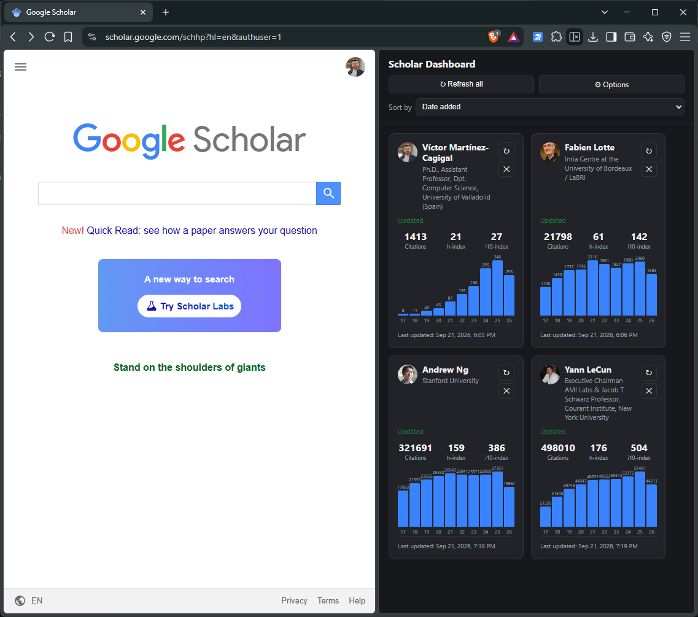
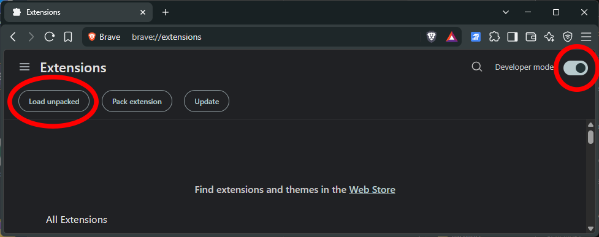
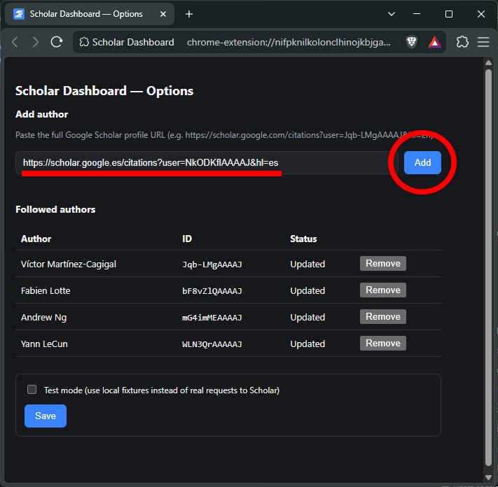

# Scholar Dashboard

A Chrome/Brave browser extension that tracks the Google Scholar authors you
choose to follow, showing their citation count, h-index, i10-index and
citations-per-year chart in a side panel — always one click away, with no
account, backend, or paid API involved.

<!--
  IMAGE 1 (hero/banner): a screenshot of the side panel itself, with 3-4
  author cards visible (photo, name, affiliation, citation metrics and the
  bar chart). This is the single most important image in the README — it's
  what sells the extension at a glance. Take it with a couple of real or
  test-mode profiles loaded so the cards look populated, not empty.
-->


## Why

Google Scholar has no official API. Free alternatives (OpenAlex, Semantic
Scholar) return noticeably lower citation counts than Scholar itself,
especially for recent citations. This extension instead reads the public
HTML of a Scholar profile using your own browser session — the same data
you'd see by visiting the profile yourself — with no third-party service
in between and no cost.

## Features

- Side panel dashboard with one card per followed author: photo, name,
  affiliation, total citations, h-index, i10-index, and a 10-year
  citations-per-year bar chart.
- Add or remove authors by pasting their Scholar profile URL.
- Manual refresh per author, or refresh all at once.
- Automatic daily refresh, always staggered (never all requests at once)
  to avoid triggering Google's rate limiting.
- Clear "blocked" and "error" states shown directly on the affected card,
  instead of failing silently.
- Sort authors by h-index or alphabetically.
- A "Test mode" (in Options) that uses local sample data instead of real
  network requests — useful for trying the extension out risk-free.

## Where to get it

This extension is **not published on the Chrome Web Store**. It's
distributed as a `.zip` file attached to the
[GitHub Releases](../../releases) page of this repository.

## Installation

1. Go to the [Releases page](../../releases) and download the `.zip` file
   from the latest release (e.g. `scholar-dashboard-v1.0.0.zip`).
2. Unzip it into a folder you'll keep around — don't delete it afterwards,
   Chrome/Brave loads the extension directly from that folder.
3. Open `chrome://extensions` (or `brave://extensions` in Brave).
4. Enable **Developer mode** (top-right toggle).
5. Click **Load unpacked** and select the folder you unzipped in step 2.

<!--
  IMAGE 2: a screenshot of the chrome://extensions page with the
  "Developer mode" toggle switched on and the "Load unpacked" button
  visible/highlighted, so a non-technical user can visually match what
  they're looking for. A simple browser chrome screenshot, ideally with
  those two elements annotated (arrow or box).
-->


6. The Scholar Dashboard icon appears in the toolbar. Click it to open the
   side panel.

## Usage

1. Click the extension icon (or right-click it → **Options**) to open the
   Options page.
2. Paste the full URL of a Google Scholar profile (e.g.
   `https://scholar.google.com/citations?user=XXXXXXXXXXXX&hl=en`) and
   click **Add**.
3. Click **Save** to apply any settings changes (e.g. Test mode).

<!--
  IMAGE 3: a screenshot of the Options page with the "Add author" field
  filled in with an example URL, and the "Followed authors" table showing
  a couple of rows below it — shows the whole add-an-author flow in one
  frame.
-->


4. Open the side panel to see the author's card. Use the ↻ button on a
   card to refresh that author on demand, or **Refresh all** at the top to
   refresh everyone (still staggered, one request at a time).

## Development

```bash
npm install
npm test              # unit tests (parser, queue, author ID extraction)
npm run dev:panel      # side panel/options in a plain browser tab, with sample data
npm run build          # production build into dist/
```